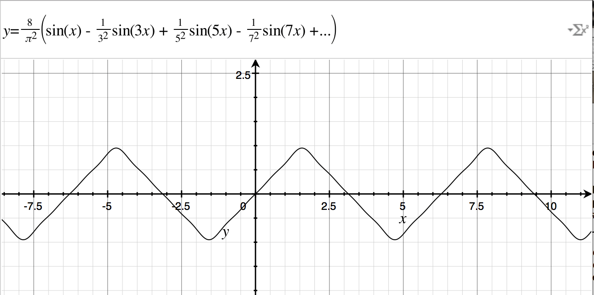
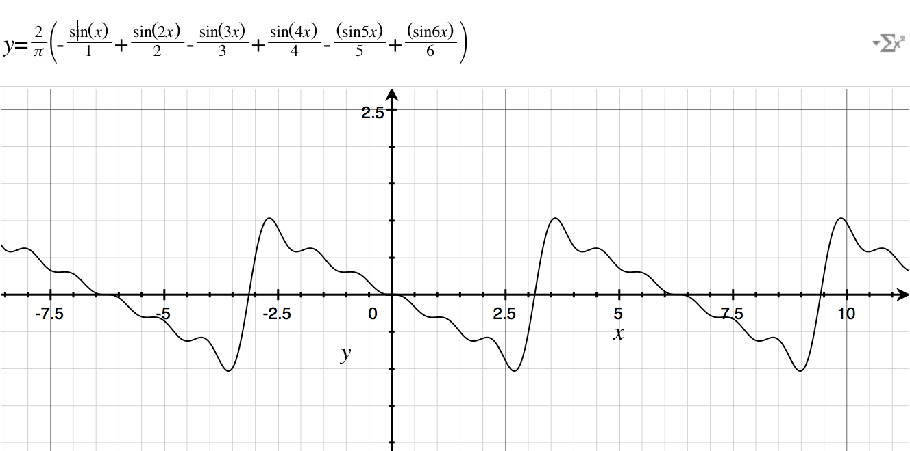
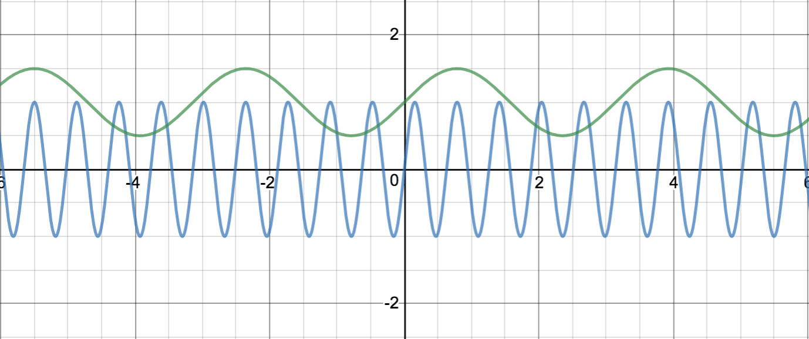
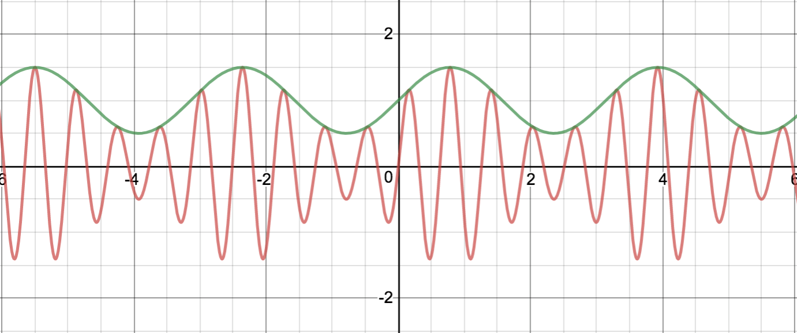
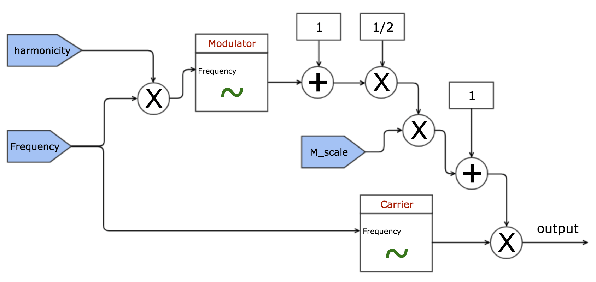
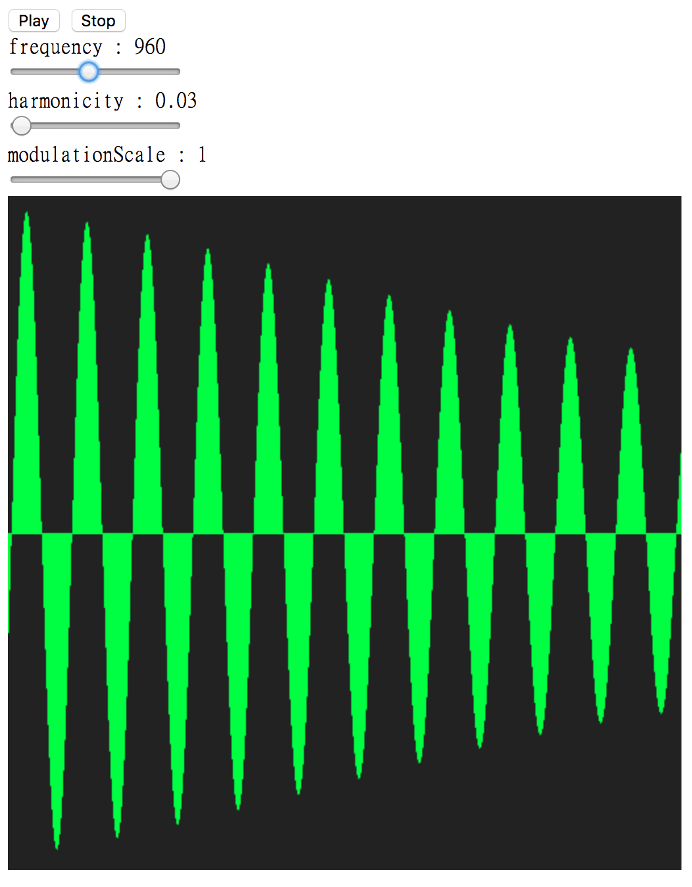

# Amplitude Modulation Oscillator 幅度调制振荡器
早从1950年代开始，创作电子乐的先驱们就开始在模拟信号合成器上探索各种声音的创作，那时人们普遍的做法都是将许多振荡器的输出叠加以混合出不同的效果（之后采用这种方式的合成器被称作加法合成器），比如现在所有振荡器都支持的三角波、锯齿波、方波都可以采用加法的方式生成（不过在 webaudioAPI 中是通过输入一串虚部与实部的系数再通过逆傅立叶变换计算得到的）。

三角波 triangle wave

锯齿波 sawtooth wave

方波 square wave

起初人们对这些新颖的声音非常兴奋，但是没多久人们就意识到单纯的用加法器连接多个振荡器的输出并不能创造出多么复杂的信号，而且这种做法在当时还是一件非常奢侈的事情（因为会需要非常多的振荡器）。这也迫使人们从理论的角度去分析信号的构成，对于简单的周期信号，幅值、频率和相位就成了三个基本要素，而对振荡器进行调制就是对这三个参数进行修改。

## Amplitude modulation

当一个信号（carrier 载波信号）的某些属性受到另一个信号（modulator 调制信号）的控制的过程，就可以成为调制（Modulation），顾名思义，幅值调制就是载波的幅值受到调制型号的控制。
最早在1960年代，德国作曲家 Karlheinz Stockhausen 就在创作音乐的过程中开始使用幅值调制。
在音乐创作中，AM 经常用来制作震音（tremolo），并且在 modulator 的频率较低时效果明显。

简单的 AM 合成器通常只有需要两个振荡器，不过更复杂的可能包含更多振荡器，比如让调制信号的的输出再被第三个振荡器调制，不过怎么复杂，最终的原理都是类似的，这里就只讨论仅包含两个振荡器的情况，不过其中还细分由两种 classic amplitude modulation (AM) 和 ring modulation (RM)。

## classic amplitude modulation
设载波的频率为fc；调制信号的频率为fm，幅值为Am，幅值偏移常量为Ac，则调制过程可以表示为：

y = (Am•sin(fm•t) + Ac) • sin(fc•t)

由三角函数公式可得：

y = Am•sin(fm•t)•sin(fc•t) + Ac•sin(fc•t)

y = 1/2•Am(cos((fc-fm)t) - cos((fc+fm)t) + Ac•sin(fc•t)

在频谱上，最终的调制信号比载波多出了频率为 fc-fm 和 fc+fm 的边带（sidebands），且边带信号的幅度为 1/2•AM
也就是说，边带是相对载波频率对称分布的。

蓝色的为载波信号，绿色的为调制信号，红色的输出信号

## ring amplitude modulation
RM 和 AM 相比，只是移除了 Ac，使载波的幅值完全由载波信号决定：

y = (Am•sin(fm•t)) • sin(fc•t)

y = 1/2•Am(cos((fc-fm)t) - cos((fc+fm)t)

最终输出的信号也不再含有原始的载波的频率了。假如一个乐器发出的声音的原始频率为 440hz（c4），调制信号的频率为110hz，则最终得到的
信号的则是幅值等量频率分别为 330hz 和 550hz的信号的叠加，这种频率不成倍数关系的的信号有时听起来会很气怪，但正是这种奇怪的感觉制造了震音的效果。

## webaudio api 的实现
这里实现的是 classic amplitude modulation 的振荡器，其中一些参数的设计和公式也略有不同

y = (1/2 • (sin(t•frequency•harmonicity) + 1) • M_scale + 1) • sin(t•frequency)

这种方式下，调制信号的频率与载波的频率相关，当 harmonicity 取正整数的时候，得到的声音就含有泛音分量（就是载波频率的整数倍），
同时调制的程度由 M_scale 控制， M_scale 为 0 则没有调制控制，而调制信号的输出乘1/2再加1是为了避免负数的干扰

最终的效果和具体的实现可以查看 code 目录下的程序，当 harmonicity 的取值较小时，颤音的效果也相对比较明显

