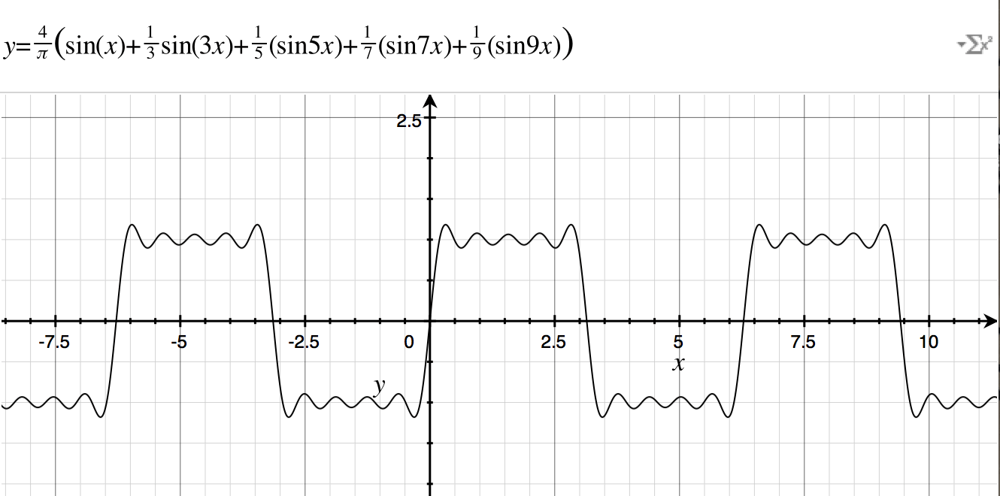

# Amplitude Modulation Oscillator 幅度调制振荡器
早从1950年代开始，创作电子乐的先驱们就开始在模拟信号合成器上探索各种声音的创作，那时人们普遍的做法都是将许多振荡器的输出叠加以混合出不同的效果（之后采用这种方式的合成器被称作加法合成器），比如现在所有振荡器都支持的三角波、锯齿波、方波都是采用加法的方式生成。

三角波 triangle wave

锯齿波 sawtooth wave

方波 square wave

起初人们对这些新颖的声音非常兴奋，但是没多久人们就意识到单纯的用加法器连接多个振荡器的输出并不能创造出多么复杂的信号，而且这种做法在当时还是一件非常奢侈的事情（因为会需要非常多的振荡器）。这也迫使人们从理论的角度去分析信号的构成，对于简单的周期信号，幅值、频率和相位就成了三个基本要素，而对振荡器进行调制就是对这三个参数进行修改。

## Amplitude modulation

当一个信号（carrier 载波信号）的某些属性受到另一个信号（modulator 调制信号）的控制的过程，就可以成为调制（Modulation），顾名思义，幅值调制就是载波的幅值受到调制型号的控制。
最早在1960年代，德国作曲家 Karlheinz Stockhausen 就在创作音乐的过程中开始使用幅值调制。

