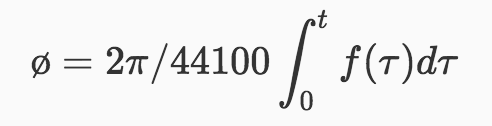
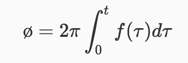

# Frequency Modulation Oscillator 频率调制振荡器

要开始分析频率调制，其中一些相关的原理和计算就必须在一开就弄清楚。

简单的概括调频就是载波的输入频率受到基带信号的控制，因此不妨先用下面的图表示这个过程：

fm 调制信号的频率
d  调制信号的幅值
fc 频率偏移常量
ac 载波的幅值

对应的数学表达式可以写为：

<B>y = Ac<I>cos</I>(2π\*fc*t + d/fm\*<I>sin</I>(2π\*fm\*t))</B>

不过等等，如果把输入到 Carrier 的频率作为一个整体的话，写出来的表达式难道不是 y = Accos(2π\*t * (fc + d\*cos(2π\*fm\*t)) 么？这两者的波形图最后绘制出来会有很大不同。在最初开始思考这个问题的时候确实困扰了我很久，如果要解释为什么数学表达式看起来和上图看起来“好像”有点不同就必须先了解 瞬时频率、瞬时相位、以及计算机处理时变问题的方式。

首先，可以仔细想一下时间 t 在调制的过程中到底是什么？对于简单的余弦波振荡器而言，其输出就是 cos(ø)，真正决定数值的是那个时刻的瞬时相位，而对于振荡器，我们一般所理解的频率的含义是单位时间内周期信号的周期数，
如果频率是 440hz 就可以说 1秒 钟内有440 个周期，或者说 sin 函数的相位 ø 一共增加了 440 个 2π。

假设现在有一个正弦波振荡器的频率为 440hz，采样率为44100hz，也就是说每一秒钟会记录 44100 次该信号的数值，
由 440hz 可知每秒钟的相位增量为 440\*2π，那么每次采样的相位增量就是 (440*2π)/44100，假设初始相位为0，
那么振荡器的相位 ø 就是每个采样的相位变化量的累加，现在如果将频率定义为函数 <I>f</I>(τ)，对于刚刚的例子，
<I>f</I>(τ) 的值始终为 440，如果考虑连续性，将数不尽的微小增量累加，就是对其进行积分，那么此时瞬时相位就有了新的表达形式：

<!-- ø = 2π/44100 *∫0t f(\tau)d\tau -->

<!-- $$ø = 2π/44100\int_0^t f(\tau)d\tau$$ -->

如果考虑时间单位是秒的话，就是

<!-- $$ø = 2π\int_0^t f(\tau)d\tau$$ -->

此时，我们输入的 <I>f</I>(τ) 其实就是瞬时频率（440hz），而相位就是瞬时频率对时间的积分，换句话说，某一时刻相位 ø 的变化率就是该时刻的瞬时频率。之所以要将瞬时频率用函数 <I>f</I>(τ) 来表示，是因为它完全是可以随意改变的，比如在某个时刻突然将输入的频率由 440hz 调成 220hz，但是最终积分出来的结果依然是正确的，可是如果只是简单的认为 ø = 220\*2π\*t ，得到的结果肯定是不正确的。

在明确了我们输入给振荡器的其实瞬时频率同时也是相位的变化率这一点之后，也就理解为什么一开始的模型图对应的数学表达式中的相位 ø = 2π\*fct + d/fmsin(2π\*fmt) 。可以尝试对 t 求导：
ø`, = 2π(fc + d\*cos(f_m*t))，得到的频率正好是输入给 Carrier 的值，在了解了公式之后，剩下的就是对一些概念的认识。

<B>调制指数 Modulation Index</B> 指的就是公式中 d/fmsin(2π\*fmt) 的最大值，这里也就是 
  
d/fm => Modulation Index
  
<B>最大频偏 peak frequency deviation</B> 就对应 d

d => ∆f

⚠️注意，最大频偏 ∆f 其实和调制信号的频率没有关系，而在 ∆f 保持不变的情况下，Modulation Index 和调制信号的频率 fm 成反比。

## 频谱分析
直观上看，载波接受的频率是随时间不停变化的，对于这种情况，着实不好下手。不过还是先尝试将信号 y 分解，最终我们希望得到的是可以消除相位中的 sin 函数，并且最好能发现频率分布与 fc 以及 fm 的关系。

先不考虑 Ac 并用 K 带换一下 d/fm，  ，再用三角函数的和差化积公式把式子分解：

<image src="./assets/eq-3.png" height="80px" align=center/>

现在式子的两项长得差不多，如果能找到方法分解第一项，第二项也能同样分解，所以现在先考虑第一项。
第一项的式子中依然有 cos(Ksin(2πfmt))，回想一下欧拉公式

<image src="./assets/eq-4.png" height="37px" align=center/>

用 Ksin(2πfmt) 代换 x 得

<image src="./assets/eq-5.png" height="38px" align=center/>

emmm，欧拉公式可以得到长得很像的式子，又因为三角函数可以表示为

<image src="./assets/eq-6.png" height="50px" align=center/>

现在为了表示方便，先将 2πfmt 用 θ 表示，那么 eiKsin(2πfmt) 可以推导出

<image src="./assets/eq-7.png" height="135px" align=center/>

又因为 ex 可以展开成幂级数

<image src="./assets/eq-8.png" height="115px" align=center/>

所以可得

<image src="./assets/eq-9.png" height="135px" align=center/>

设 α = m-n，则 m = α + n，此时用 α 代换 m，但是需要注意外层求和的下界不在是 0 而是 -∞，这是因为当 m 为 0 时，n 可以取到 +∞，如要保证 α + n = 0，α 就需要为 -∞。
所以上式变为：

<image src="./assets/eq-10.png" height="65px" align=center/>

而等式右侧的内求和正是第一类贝塞尔函数（Bessel functions of the first kind）的表达式

<image src="./assets/eq-11.png" height="60px" align=center/>

这时使用贝塞尔函数的性质 <B>J-nx = (-1)nJnx </B>来处理外积分中 α < 0 的情况

<image src="./assets/eq-12.png" height="190px" align=center/>

再结合之前推导的等式 eiKsin(θ) = eKeiθ/2 * e-Ke-iθ/2 = cos(Ksin(θ)) + isin(Ksin(θ))
我们大致就能发现规律了，实际上数学上已经有下面的公式：

<image src="./assets/eq-13.png" height="110px" align=center/>

而上面一系列的推导过程的得到的等式其实就是 <B>雅各布-安格尔展开（Jacobi-Anger Expansion）</B>

现在重新用 2πfmt 表示回 θ，把上面的公式代入到最初和差化积得到的 y 的表达式中，并在求和项中运用三角函数的积化和差公式

第一部分：

<image src="./assets/eq-14.png" height="110px" align=center/>

第二部分：

<image src="./assets/eq-15.png" height="110px" align=center/>

最终可以得到

<image src="./assets/eq-16.png" height="60px" align=center/>

所以，从上式中可得输出信号的含有无数个不同频率的分量，且取值为 fc + nfm，n为整数，这样看来，貌似还是没法有效的分析。。。。不过不需要太紧张，
因为从贝塞尔函数表达式上看，当 K 不变，n由0增大到正无穷，Jn(K)的绝对值是趋近于0的

(图片来自维基百科)

<image src="./assets/bessel-min.png" height="300px" align=center/>