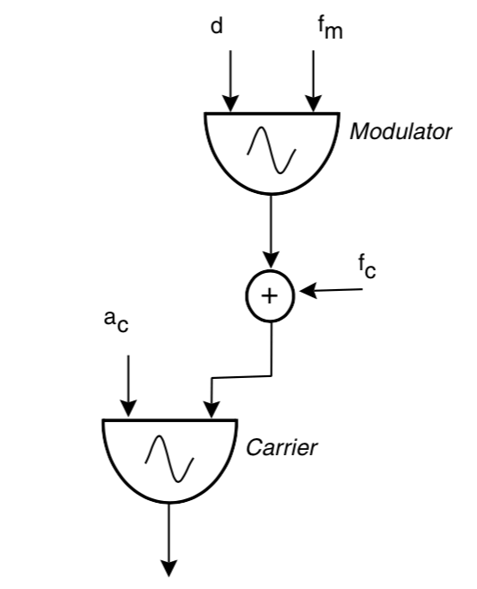

# Frequency Modulation Oscillator 频率调制振荡器

要开始分析频率调制，其中一些相关的原理和计算就必须在一开就弄清楚。

简单的概括调频就是载波的输入频率受到基带信号的控制，因此不妨先用下面的图表示这个过程：

fm 调制信号的频率
d  调制信号的幅值
fc 频率偏移常量
ac 载波的幅值

对应的数学表达式可以写为：

$$y = A_c*sin(f_c*t + 1/d*cos(f_m*t))$$

不过等等，如果把输入到 Carrier 的频率作为一个整体的话，写出来的表达式难道不是 $y = A_c*sin(t*(f_c + 1/d*cos(f_m*t))$ 么？这两者的波形图最后绘制出来会有很大不同。在最初开始思考这个问题的时候确实困扰了我很久，如果要解释为什么数学表达式看起来和上图看起来“好像”有点不同就必须先了解 瞬时频率、瞬时相位、以及计算机处理时变问题的方式。

首先，可以仔细想一下时间 $t$ 在调制的过程中到底是什么？对于简单的正弦波振荡器而言，其输出就是 $sin(ø)$，真正决定数值的是那个时刻的瞬时相位，而对于振荡器，我们一般所理解的频率的含义是单位时间内周期信号的周期数，
如果频率是 440hz 就可以说 1秒 钟内有440 个周期，或者说 $sin$ 函数的相位 ø 一共增加了 440 个 2π。

假设现在有一个正弦波振荡器的频率为 440hz，采样率为44100hz，也就是说每一秒钟会记录 44100 次该信号的数值，
由 440hz 可知每秒钟的相位增量为 $440*2π$，那么每次采样的相位增量就是 $(440*2π)/44100$，假设初始相位为0，
那么振荡器的相位 ø 就是每个采样的相位增量的累加，现在如果将频率定义为函数 $f(\tau)$，对于刚刚的例子，
$f(\tau)$ 的值始终为 440， 如果考虑连续性，将数不尽的微小增量累加，就是对其进行积分，那么此时瞬时相位就有了新的表达形式：

$$ø = 2π/44100\int_0^t f(\tau)d\tau$$
如果考虑时间单位是秒的话，就是

$$ø = 2π\int_0^t f(\tau)d\tau$$

此时，我们输入的 $f(\tau)$ 其实就是瞬时频率（440hz），而相位就是瞬时频率对时间的积分，换句话说，某一时刻相位 ø 的变化率就是该时刻的瞬时频率。之所以要将瞬时频率用函数 $f(\tau)$ 来表示，是因为它完全是可以随意改变的，比如在某个时刻突然将输入的频率由 440hz 调成 220hz，但是最终积分出来的结果依然是正确的，可是如果只是简单的认为 $ø = 220*2π*t$ ，得到的结果肯定是不正确的。

在明确了我们输入给振荡器的其实瞬时频率同时也是相位的变化率这一点之后，也就理解为什么一开始的模型图对应的数学表达式中的相位 $ø = f_c*t + 1/d*sin(f_m*t)$ 。可以尝试对 $t$ 求导：
$ø^, = f_c + d*cos(f_m*t)$，正是输入给 Carrier 值

